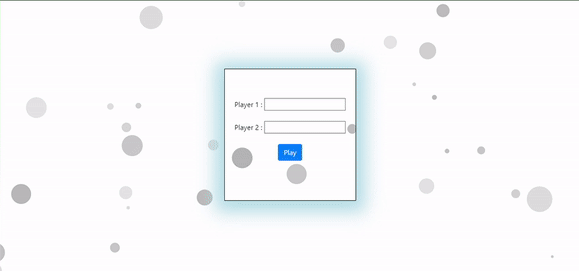
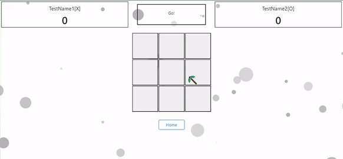
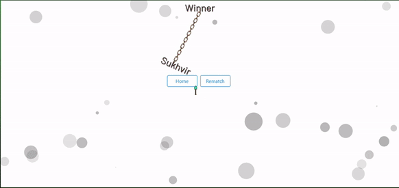

# Version 1.0.0 (Static APP)

> [!Note]
> This Project is just for Practice JavaScript and Game Set-put and also wanna play with Logic.<br> >**[Static App Link](https://beautiful-lollipop-2f84ff.netlify.app/)**<br> >**[Dynamic App Link](https://tic-tac-toe-one-lemon.vercel.app)**

## Game Skeleton

The First Working App Is Done With in Few hours, Since I have already done The logic with C Back in the early days

I wasn't sure how should I come up with the fact that after one turn instead of `X` we should use `O` to mark the button. So I came up with this solution which I still think could be better but it's working right you know what they say, **_"when the program is working don't touch it"_**

```js
var count = 0;

function checkSymbol(count) {
    if (count % 2 == 0) {
        return "X";
    } else {
        return "O";
    }
}
```

> Now For every First turn player would be to use `X` and for the second player he can use `O`, Because after every turn I will increase the counter with one<br>

Like this:

```js
test.forEach((test) => {
    test.addEventListener("click", () => {
        if (test.innerHTML == "&nbsp;") {
            symbol = checkSymbol(count);
            test.innerHTML = symbol;
            count++;
            checkResults();
        }
    });
});
```


For now every box I'm using as a button and after every click I'm checking if the player has won or not.
If somebody wins it creates a text and display it on the screen

```js
function YouWin() {
    var div = document.querySelector(".textbox");
    var Text = document.createTextNode("YOU WIN");
    div.appendChild(Text);
}
```


Now this game is playable by two persons but there are a lot of stuff we can improve, so let's start working on it

# Version 1.1.0

Instead of manually loading the Page i added a Reload Icon and instead of Showing **You Win** which was bit unclear i replaced it witch **Gamer Over**


# Version 2.0.0 (Dynamic APP)

Shifting code to next.js surely wasn't easy, i had to create completely new code to replicate the frame of my Tic Tac Toe.
which i achieved making an array of boxes and filling the empty property which i named symbol.

```js
const [boxes, setBox] = useState([...Array(9).fill({ symbol: "" })]);
```

and then i mapped the whole array to to create the button tags and also embedded the classNames to support my same CSS

```js
boxes.map((box, index) => (
    <React.Fragment key={index}>
        {(index == 3 || index === 6) && <br />}
        <button
            className={`${style.style1} ${style.box}`}
            onClick={() => ChangeSymbol(index)}
        >
            {box.symbol}&nbsp;
        </button>
    </React.Fragment>
));
```

`{(index == 3 || index === 6) && <br />}` I hardcoded District condition to make To make the shape of a square<br>

## Learnings

One main thing I learned after coding this APP, Is it to compare a pattern with a simple condition which is quite useful because my logic to check the winner was nearly of 50 lines which I replaced with this

```js
const winPatterns = [
    [0, 1, 2],
    [3, 4, 5],
    [6, 7, 8],
    [0, 3, 6],
    [1, 4, 7],
    [2, 5, 8],
    [0, 4, 8],
    [2, 4, 6],
];

for (const pattern of winPatterns) {
    const [a, b, c] = pattern;
    if (
        boxes[a].symbol &&
        boxes[a].symbol === boxes[b].symbol &&
        boxes[a].symbol === boxes[c].symbol
    ) {
        console.log("winner");
        setWinnerNotFound(false);
        return;
    }
}
```

For the future updates my plans are to add a Form to input Player 1 and Player 2 Names before displaying the game board, let's code that!

# Version 2.1.0

In this version I introduced a form where player 1 and player names can be entered,before entering the game I also used summer css to make it look better


After hitting play button going to the game board seems bit dull, so I added the animation Using CSS, Actually different animation for different screens because my main animation works perfectly with laptop screen, But for smaller screens it looks completely weird so for this phone I added just a simple fade in using media query

```css
@media (min-width: 950px) {
    .fadeStyle {
        animation: slideIn 3s ease;
    }
}
@media (max-width: 950px) {
    .fadeStyle {
        animation: fadeIn 4s ease;
    }
}
```

And added their corresponding animations

```css
@keyframes slideIn {
    0% {
        opacity: 0.1;
        margin: 1px 100px 1px 100px;
    }
    100% {
        opacity: 1;
        margin: 1px 1px 1px 1px;
    }
}
@keyframes fadeIn {
    0% {
        opacity: 0;
    }
    100% {
        opacity: 1;
    }
}
```

Yes so far It looks good and it works good but I wanted to use those input player names on the top of play board screen to show How many points each player earned by winning, Let's work on the next Version

## Version 2.2.0

In this version I have covered a lot of stuff, i used the player points to display left and right on the top


Every time a player scores 3 first will win the Game, and his name will be displayed on the screen with the css animation which took me longer than i thought for coding


I know it is not perfect Swing animation, which is still bugging me but it's better than something not there after winning

> [!Note]
> Don't mind my minecraft Mouse 😏

I also used the sounds of mortal combat Rounds like:
[Round1](/dynamicapp/public/sounds/round1.mp3),
[Round2](/dynamicapp/public/sounds/round2.mp3),
[Round3](/dynamicapp/public/sounds/round3.mp3),
[Round4](/dynamicapp/public/sounds/round4.mp3) and
[FinalRound](/dynamicapp/public/sounds/finalRound.mp3)<br>
I think its makes my game cool, i don't know.

Next up, as you can see in Gif above i have used [particles](https://particles.js.org) which i haven't yet Dug deeper into Because my main Focus is on the Completion of this project

## What i Learned

-   `css` Skills boosted
-   Learned About `particles`
-   `File-loader` a npm package<br>
    I am still learning about this but what I have done is used this code to do the configuration for the importing of the MP3 files to use in my code
    ```js
    webpack: (config) => {
        config.module.rules.push({
            test: /\.(mp3)$/,
            use: {
            loader: 'file-loader',
            options: {
                publicPath: '/_next/static/',
                outputPath: 'static/',
            },
            },
        });

        return config;
        },
    ```
-   `client-side-rendering`<br>
    This actually took me a longer time to figure out how to put the audio in the next jss app, i was using this line of code `var round1Audio = new Audio(round1Sound);` Which was a keeper giving me error That the audio Constructor is not defined. I tried a ton of time to use it but at the end I did the research that audio constructor is can only be used when the window is defined means that _when code is rendered on the client side_
    To overcome this I simply used a statement to check whether Or not the code is on the client side or the server side `if (typeof window !== "undefined")` Which solved whole issue

In the next version I just want to add home screen or to do a rematch button after a player has won the game and also I want to save the game progress, right now if we refresh the page we loses all the game progress and just displays the first page

## Version 2.2.1

finally new version!<br>
I actually spend a lot of time working on this, let's talk about it

1. First I Changed the particles so that it can you look little better and I added it to the form page as well as on the game UI
   
   
   

As you can see I entered the buttons as well, player can also go to home while in game but they have to confirm it first<br>
So what I did is I used `UseRef` To change The style in the component at dynamic time.

```js
 <Button
        ref={cancelRef}
        onClick={() => cancel()}
        className={style.cancel}
>
        ❌
</Button>

<Button
    variant="outline-primary"
    onClick={() => homeInGame()}
    className={style.SingleHomeButtonCSS}
>
    Home
</Button>

<Button
    ref={confirmRef}
    onClick={() => confirm()}
    className={style.confirm}
>
    ✔️
</Button>

```
And I made a little switch function to switch the visibility of ❌ and ✔️

```js
function homeInGame() {
    if (cancelRef && confirmRef) {
        cancelRef.current.style.visibility = "visible";
        confirmRef.current.style.visibility = "visible";
    }
}
function cancel() {
    if (cancelRef && confirmRef) {
        cancelRef.current.style.visibility = "hidden";
        confirmRef.current.style.visibility = "hidden";
    }
}
function confirm() {
    props.setIsSubmitted(false);
    props.setValue("Player1", "");
    props.setValue("Player2", "");
    rematch();
}
```

As per for the saving Game progress, I will do it in upcoming versions!